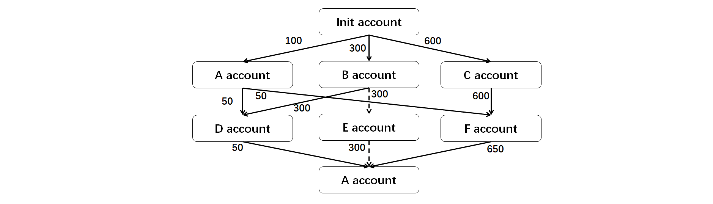
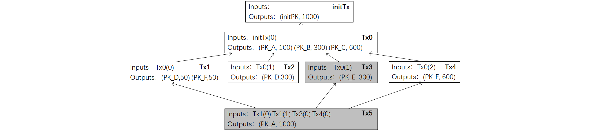

# HOMEWORK_1
*Name:* **高天琦**  
*Class:* **2019 FinTech**  
*Student ID:* **1901212578**

### **Ⅰ - Preparations before Coding**
1. *To understand the requirements in detail, I read the provided files  carefully and I added enough annotations into the files according the software principles.*
2. *And next, I make it clear about the structures of every Classes and Functions, such as*  
    >public byte[] getRawDataToSign(int index);  

    This is a function in Transaction class, where the i-th input and all of the outputs are transferred to raw data prepared for signing.
    > public void finalize();  

    This is a function over the built-in finalize() function in Transaction class, where the unique ID - hash value will be set to the transaction.
    > public static boolean verifySignature(PublicKey pubKey, byte[] message, byte[] signature);  

    This is a function in Crypto class, which verifies the signature in Transaction.Input class, making sure for the acceptance of the coin-flow from the coin owner.
    >public boolean contains(UTXO utxo);  

    This is a function in UTXOPool class, which return false if the UTXO verified is not in the UTXOPool, otherwise return ture. I think this is the core of UTXOPool class.
3. *Then I checked again the functionalities needed in Txhandler class and list them in a more logical way.*
### **Ⅱ - Coding Part**
1. ***The constructor of Txhandler class***  

    The constructor of Txhandler class is easy.
2. ***public boolean isValidTx(Transaction tx)***  
    According to the requirements, I design several branches in isValidTx function.
    >if (tx == null) {...}  

    To check if the input transaction is a null pointer and improve robustness of the function.
    >if (!pool.contains(u)) {...}  
    
    To check if the UTXOPool contain the UTXO generate by the Input field of the input transaction.
    >if (bufferPool.contains(u)) {...}  

    To check if any of the Inputs in the same transaction are duplicated (double-spend). 
    >if (!Crypto.verifySignature(preOutput.address, tx.getRawDataToSign(i), in.signature)) {...}  

    To verify the signature of every Input.
    >if (out.value < 0) {...}  

    To make sure that there is no negative Output.value in the transaction.
    >if (outputSum > inputSum) {...}  

    To make sure that the sum of Output.values is not greater than the sum in input values.
3. ***public Transaction[] handleTxs(Transaction[] possibleTxs)***  

    The function focuses on the double-spend situations among More-Than-Only-One transactions. So the kernal part of the function is to dynamically check and update UTPXPool built in the ledger (the Txhandler class) in time.

    >for (Transaction tx : possibleTxs) {...}

    To get every transaction in the set of possibleTxs.
    >   if ( ! isValidTx(tx) )  continue;

    First, I verify the transaction. if it is not validate, continue directly to check next transaction.

    >   ansList.add(tx);

    If it is valid, I accept it in the ans-transactions list, then update the UTXOPool with both Input elements 
    >for (Transaction.Input input : tx.getInputs()) {...}  

    and Output elements.
    >for (int i = 0; i < tx.numOutputs(); i++) {...}

    That is it, in the process of updating the UTXOPool in time, double-spend situations will be avoided automatically.
### **Ⅲ - Testing Part**
1. *I build a CreateKeys class to package useful functions in the process of coding and debugging the Test File. They are about encoding keys to String, generating and storing key pairs and so on.*
2. *In the @Before function, I get the ledger with a UTXOPool and create 1000 coins in it for next steps of testing.*  

3. *The tests for isValid function basically follow the required functionalities. I list the test cases in a form.*  

    |Functionality of Cases|TestFunctions|Data for Testing|Expected Results|
    | --- | --- | --- | --- |
    |Avoid null pointer input|testIsValidTx1|Tx with "null" value |false|
    |Avoid that sum of outputs is greater than that of inputs|testIsValidTx2|Tx with 1000 inputSum and 1001 outputSum|false|
    |Test for UTXO not contained in UTXOPool|testIsValidTx3|Tx with correct pre-hashValue but wrong index of pre-Output| false|
    |Verify the signature in Input field|testIsValidTx4|Tx with signature on a wrong rawData of pre-Transaction.|false|
    |Avoid any outputs with negative values|testIsValidTx5|Tx with output value of -1|false|
    |Avoid double-spending in the same transaction|testIsValidTx6|Tx with two pre-hashValues in inputs field both based on the ONE UTXO in UTXOPool| false|

4. *The tests for handleTxs function is more like a real situation in real coin flow. I designed a situation to test it. The coin-flow of the case is shown below.*  

    

    *and I organized the coin flow into transactions like this.*

    

    *HandleTxs function will scan the transactions in order Tx0 to Tx5 to decide which transactions are valid.*

    >Normally, the coin flow shown in the first image as dotted line are not valid, thus the transactions shown in second image in grey are not valid because of double-spending. Then handleTxs function should return a list of Tx0, Tx1, Tx2, Tx4.
5. *Results of testing*: *The functions pass all of the above tests, returning the expected results. Below is the screenshot in IntelliJ IDEA IDE.*

    
