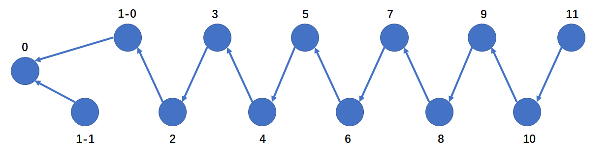
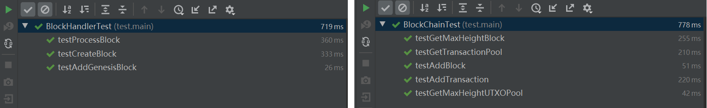

# Homework-2
**高天琦 2019级金融科技**

### Data Structure Design and Coding
BlockChain Class needs to meet these requirements: it is able to
* maintain a blockchain and update the memory in time to delete unnecessary blocks.
* create a blockchain with a genesisblock
* find the "heightest" block and the UTXOPool connecting to it
* maintain a pool for coming transactions
* add blocks to the chain and following the rules of appending the blocks.

I add a *BlockNode Class* in the project, in which the block itself, the position of the Block in Blockchain and the UTXOPool connecting to the block are all recorded. The class is useful to management blocks.

And I use Hash structure to maintain the blocks, it is useful to be efficient to find a specified block. Besides the six functions in Blockchain class, I add a function called *freeMemory()* into it to maintain the structure of the blockchain in order to avoid memory overflowing.

### Testing
I finished the testing in two files, one fucuses on the *BlockChain Class*, the other focuses on the *BlockHandler Class.*

|Functionality of Cases|Functions Name|Data for Testing|Expected Results|
| --- | --- | --- | --- |
|test we can get the max height block|testGetMaxHeightBlock|genesisBlock|the hash of genesisBlock|
|test we can get the max height UTXOPool|testGetMaxHeightUTXOPool|the UTXO of genesisBlock|True|
|test we can get transaction pool in time|testGetTransactionPool|5 random transactions|the correct number of transactions in the pool now|
|test we can add block to the chain|testAddBlock|A new block appending on the genesisblock|the correct new height of the chain|
|test we can add block to the chain in CUT_OFF_AGE|testCreateBlock|11 blocks|the size of the block set increases|
|test we can not add genesisblock to the chain|testAddGenesisBlock|a genesisblock| the chain never changes|
|test we can add tx to the transaction pool| testAddTransaction| 5 transactions|the correct number of new transactions in the pool|
|test the memory management is working in order to avoid memory overflowing|testCreateBlock|13 blocks|the structure of the chain is changed dynamically|
|test the function can return the oldest block as max height block|testCreateBlock| 3 blocks including genesisblock|the 1_0 block is returned|
|test we can add a block not on the mainbranch|testProcessBlock| a random block| the correct new height of the chain|

The most test cases is based on the structure of blockchain below. 

Most of the test cases are designed on block 1-0, block 1-1, block 2, and block 11.

Finally, all the test cases are passed.
